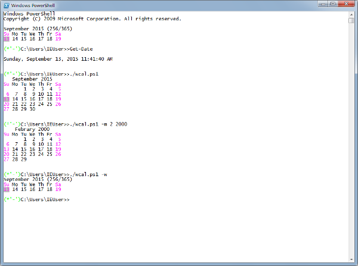

#Display calendar for PowerShell.
今週/今月のカレンダーを表示するPowerShellスクリプトです。  
[shellscript版のxcal](https://github.com/Takeru-chan/xcal)をPowerShellで書き直しています。  
まだ複数月の表示ができません。休日の表示も土日のみ。  

##Usage | 使い方
引数なしで起動すると今月のカレンダーを表示し、今日の日付をハイライトします。  
-mオプションに続けて表示月を指定できます。月指定に続けて年指定もできます。  
オプションに"-w"を指定すると、今週のカレンダーのみを表示します。  
$profileの最後に実行させると便利かな。。。  

##License
This script has released under the MIT license.  
[http://opensource.org/licenses/MIT](http://opensource.org/licenses/MIT)
